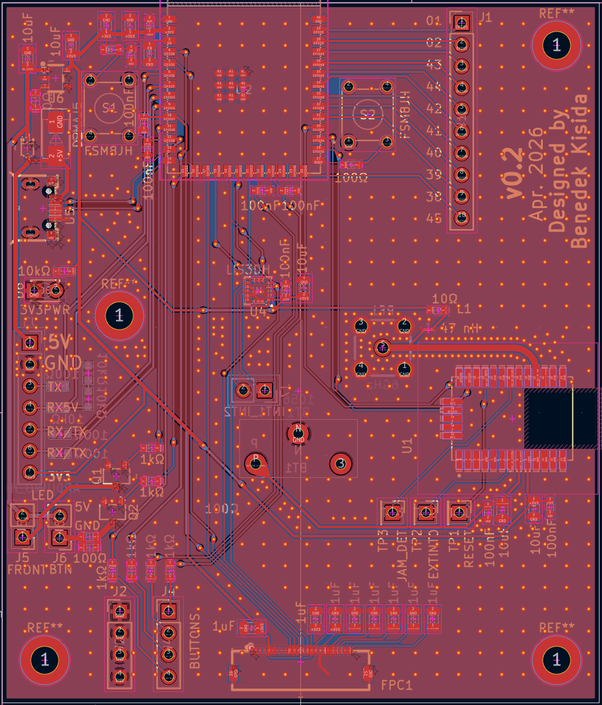
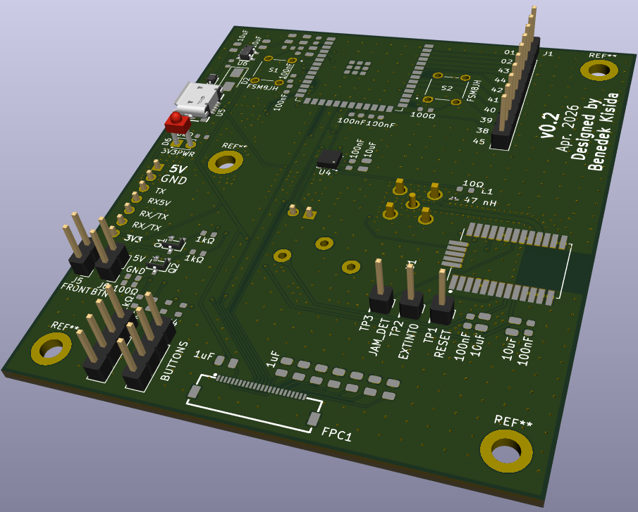
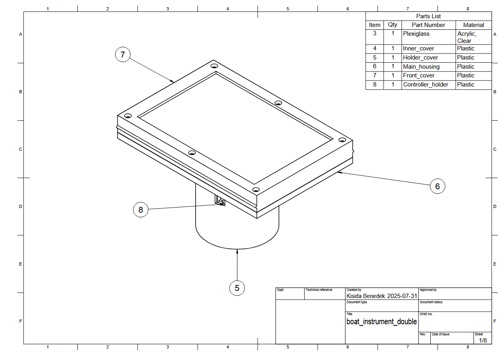
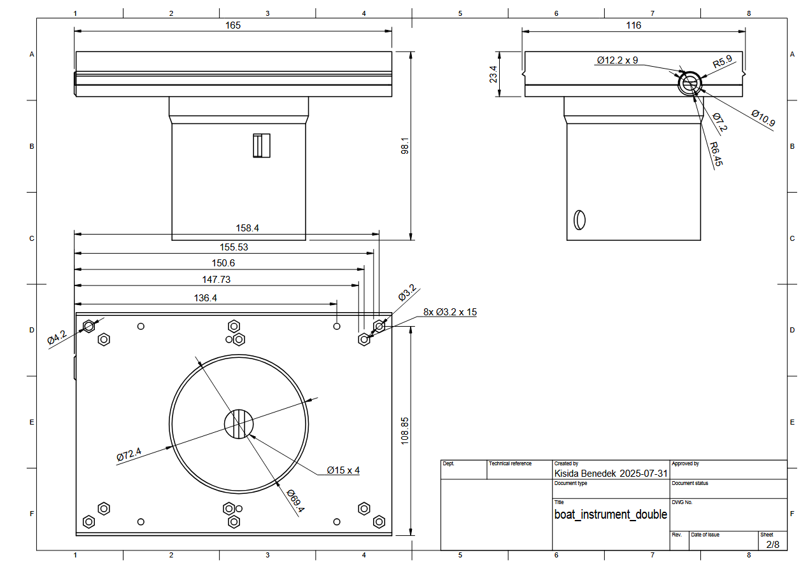

 

  <picture>
    <source media="(prefers-color-scheme: dark)" srcset="./documentation/logo_dark.png">
    
  </picture>
  <h2 align="center">ESP32 Boat Instrument</h2>

## ESPSkipper

ESP32 based, open source, low cost boat instrumentation to replace proprietary marine systems.

## Features

- GPS based speed display
- Dynamic multi-function display showing real-time metrics
- Using ST7306 300x400 reflective for good outdoors visibility with custom illumination
- Multi language support
- Configuration through settings page
- Open Echo integration, supports depth readings from the TUSS4470 shield through serial connection
- Rugged 3D printed weather-resistant housing
- Reading water temp thermistors from analog transducers

## Tech Stack

**ESP32:** C++, PlatformIO, Arduino Platform, KiCad  

## Custom PCB

You can find the custom PCB files for KiCad in the hardware folder.

  
  

### ESP32-S3 pinout:

| Module | Signal | GPIO | Notes |
|---|---|---:|---|
| Display / LIS3DH | LCD_SCLK / SPC | GPIO12 | Shared clock for both devices |
| Display / LIS3DH | LCD_SDI / SDO / MOSI | GPIO11 | Shared data output |
| Display / LIS3DH | SDI / MISO | GPIO13 | Shared data input; ignored for LCD |
| LIS3DH | CS | GPIO10 | Dedicated chip select for device 1 |
| Display (PCB variant) | LCD_RES | GPIO4 | Alternate board mapping |
| Display (PCB variant) | LCD_D/C | GPIO9 | Alternate board mapping |
| Display (PCB variant) | LCD_CS | GPIO5 | Alternate board mapping |
| Display (PCB variant) | LCD_SCLK | GPIO12 | Alternate board mapping |
| Display (PCB variant) | LCD_SDI | GPIO11 | Alternate board mapping |
| LIS3DH (PCB variant) | SDO | GPIO13 | Alternate board mapping |
| LIS3DH (PCB variant) | SDI | GPIO11 | Alternate board mapping |
| LIS3DH (PCB variant) | SPC | GPIO12 | Alternate board mapping |
| LIS3DH (PCB variant) | CS | GPIO10 | Alternate board mapping |
| GNSS (L96-M33) | RX0 | GPIO36 | GPS receiver input |
| GNSS (L96-M33) | TX0 | GPIO37 | GPS receiver output |
| GNSS (L96-M33) | FORCE_ON | GPIO35 | Module power control |
| Serial | TX1 | GPIO6 | Serial port 1 output |
| Serial | RX1 | GPIO7 | Serial port 1 input |
| Serial | TX2 | GPIO15 | Serial port 2 output |
| Serial | RX2 | GPIO16 | Serial port 2 input |
| Buttons | BTN1 | GPIO21 | Front panel button |
| Buttons | BTN2 | GPIO14 | Front panel button |
| Buttons | BTN3 | GPIO3 | Front panel button |
| Buttons | BTN4 | GPIO8 | Front panel button |

## Instrument housing

## PCB Bill of Materials (BOM)

| Ref | Qty | Value | Notes |
|---|---:|---|---|
| U2 | 1 | ESP32-S3-WROOM-1 | Main MCU |
| U1 | 1 | L96-M33 | GNSS module |
| U4 | 1 | LIS3DH | Accelerometer |
| U5 | 1 | - | Micro USB connector |
| U6 | 1 | - | 3.3V regulator |
| BT1 | 1 | 1056 | Battery holder |
| RF1 | 1 | 6GHz | SMA antenna connector |
| FPC1 | 1 | - | Flex cable connector |
| S1, S2 | 2 | FSM8JH | Tactile switches |
| J1 | 1 | Conn_01x10_Pin | 10-pin header |
| J2, J4 | 2 | Conn_01x04_Pin | 4-pin header |
| J3 | 1 | ARDUINO_IN | Arduino interface header |
| J5, J6 | 2 | Conn_01x02_Pin | 2-pin header |
| J7 | 1 | INT1_INT2 | Interrupt header |
| D2 | 1 | SMAJ5 | TVS diode |
| D1 | 1 | - | Schottky diode |
| D6 | 1 | 3V3PWR | 3.3V power LED |
| Q1, Q2 | 2 | - | S8050 transistor pair |
| L1 | 1 | 47 nH | Inductor |
| C1, C2, C3, C4, C16, C18, C20 | 7 | 10uF | Decoupling capacitor |
| C6, C22, C23, C24, C25, C26, C27, C28, C29 | 9 | 1uF | Filter / bulk capacitor |
| C5, C7, C8, C9, C10, C11, C17, C19, C21 | 9 | 100nF | Decoupling capacitor |
| R1, R7, R8, R9, R18, R19 | 6 | 100Ω | Current / pull-up resistor |
| R10, R11, R12, R13, R16, R17 | 6 | 1kΩ | LED / logic resistor |
| R3, R4, R5, R6, R14 | 5 | 10kΩ | Pull-up / bias resistor |
| R2 | 1 | 10Ω | Series resistor |
| R15 | 1 | 0Ω | Link / jumper resistor |
| TP1 | 1 | RESET | Test point |
| TP2 | 1 | EXTINT0 | Test point |
| TP3 | 1 | JAM_DET | Test point |

## Acknowledgements

 - [Open Echo](https://github.com/Neumi/open_echo)
 - [Osptek 4.2" BWR TFT Driver for ESP32-S3 (ST7306)](https://github.com/CaiZiYuan2019/Osptek-4.2-BWR-TFT-Driver-for-ESP32-S3)

